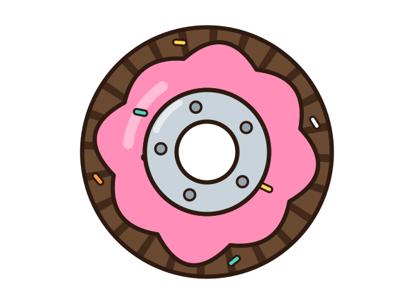

<p align="center">
  
</p>

# cc-donut

**Claude Code를 위한 도넛 스페어타이어. 시속 50마일로 집까지 데려다줍니다.**

한국어 · [English](README.md)

[](LICENSE)
[](https://github.com/sbigstar0310/cc-donut/actions/workflows/test.yml?query=branch%3Amain+event%3Apush)
[](#install)

<p align="center">
  
</p>

## Install

```sh
claude plugin marketplace add sbigstar0310/cc-donut
claude plugin install ccd@cc-donut
```

그다음 Claude Code를 열고 `/ccd:setup`을 실행하세요. 재시작은 필요 없습니다. Claude Code가 설정을 자동으로 다시 읽으므로 다음 상호작용부터 statusline이 나타나며, 이미 열린 세션에서는 `/reload-plugins`로 hook을 활성화합니다.

<details>
<summary>Claude Code 안에서 설치하고 싶나요?</summary>

슬래시 명령은 **한 줄씩** 해석됩니다. 아래 블록을 한 메시지로 붙여 넣으면 작동하지 않으므로 각각 따로 입력하세요.

1. `/plugin marketplace add sbigstar0310/cc-donut`
2. `/plugin install ccd@cc-donut`
3. `/reload-plugins`
4. `/ccd:setup` — 다음 상호작용부터 statusline이 나타납니다. 재시작은 필요 없습니다.

</details>

## What it does

Claude quota가 바닥나도 cc-donut은 도구, hook, skill, MCP server, 그리고 **지금 대화 자체**를 유지한 채 모델만 OpenRouter로 바꿉니다. 스페어타이어는 본래 임시 수단이므로, 계속 작업하는 동안 cc-donut은 quota reset을 감지해 원래 구독으로 되돌립니다. 영구적인 탈것이 아닙니다. 집까지 갈 만큼의 도넛일 뿐입니다.

왕복에 명령 두 개, 또는 [아예 없이](#automatic-handoff) — `ccd setup --auto`를 켜면 양방향 모두 칠 것이 없습니다. (막힌 그 턴만 다시 보내면 됩니다.)

## Before / After

```text
BEFORE   quota dies mid-task → stuck, restart, lose the thread

AFTER    quota dies    → /exit → ccd -c       same conversation, spare on
         quota resets  → we flag it for you   /exit → claude --resume
         same conversation, back on your subscription — round trip, zero thread lost

AUTO     quota dies    → 🍩 도넛이 알아서 장착        (ccd setup --auto)
         quota resets  → 구독으로 알아서 복귀          칠 것 없음

계정 2개  quota dies    → 남은 다른 구독으로            무과금
         둘 다 소진    → 🍩 도넛                      (ccd account add)
```

quota가 남아 있을 때 **미리** 설정하세요. 0이 된 뒤에는 Claude가 설정 과정을 안내할 수 없습니다.

```sh
ccd key           # store your OpenRouter key (hidden input, never enters chat)
ccd doctor        # ✓ OK = your spare is inflated and ready
ccd setup --auto  # 선택: 왕복을 알아서 (양방향)
```

여기까지가 필요한 전부입니다. 세부 내용은 필요할 때 아래에서 확인하세요.

<a name="멀티-계정"></a>

<details>
<summary><b>Claude 구독이 2개 이상이라면 — 돈 쓰기 전에 그것부터</b></summary>

Claude 구독이 하나 더 있는데 그걸 놀려두고 OpenRouter에 돈을 쓸 이유는 없습니다.
두 계정을 등록해두면 쿼타가 소진될 때 **여유가 남은 계정으로** 대화가 옮겨갑니다.
같은 대화, 여전히 구독, 과금 없음. OpenRouter는 원래 있어야 할 자리 —
첫 번째 수단이 아니라 마지막 수단 — 로 돌아갑니다.

```sh
ccd account add                  # 지금 로그인된 계정을 등록
claude                           # /login 으로 다른 계정 로그인
ccd account add                  # 그 계정도 등록
ccd account list                 # 두 계정과 실시간 쿼타
```

```text
A 소진  →  B에 여유 있나?  →  B     무과금, 같은 대화
        →  B도 소진?      →  🍩    OpenRouter, 진짜 최후 수단
```

나머지는 그대로입니다. 크레덴셜 교체는 **세션과 세션 사이** — 아무도 그것을 붙잡고
있지 않은 순간 — 에 일어나므로 돌아가는 Claude Code와 다툴 일이 없고, Notion·Slack
같은 MCP 로그인은 전환의 영향을 받지 않습니다.

statusline이 지금 어느 계정인지, 예비 계정이 준비됐는지 알려줍니다:

```text
● claude:personal │ spare kaist 20%
```

우선순위(등록 순서 또는 `--priority`) 순으로 고르므로 주 계정에 여유가 있는 한
주 계정을 씁니다. 그리고 **5시간·7일 창 둘 다** 여유가 있을 때만 후보가 됩니다 —
주간 창이 99%인 계정은 도착하자마자 몇 분 만에 다시 죽습니다.

`ccd doctor`가 계정별 쿼타와 — 중요하게 — **재로그인이 필요한 계정**을 짚어줍니다.
토큰이 만료된 예비 계정은 다른 어디서도 멀쩡해 보이다가 정작 필요한 순간에만
정체를 드러내기 때문입니다. 애초에 그런 일이 없도록 ccd가 하루 한 번 유휴 계정의
토큰을 갱신합니다.

> **여러 계정에 대해.** Anthropic은 구독을 여러 개 보유하는 것 자체는 약관 위반이
> 아니라고 밝혔습니다. 금지 대상은 계정 공유와 접근 권한 재판매입니다. 이 기능은
> *본인이 보유한* 구독을 위한 것입니다. 여러 사람이 함께 쓰는 계정을 등록하는 것은
> 사용자의 판단이자 책임입니다.

계정 토큰은 `~/.claude/ccd/accounts/` 에 mode 600 파일로 저장됩니다. OS에 따라
동작이 달라지지 않도록 모든 플랫폼에서 저장 방식을 하나로 통일했습니다. Linux와
Windows에서는 Claude Code가 이미 토큰을 두는 바로 그 방식이고, macOS에서는
Keychain보다 한 단계 낮습니다 — 이식성의 대가입니다. 퍼미션이 느슨해지면
`ccd doctor`가 실패로 잡습니다. 삭제는 `ccd account rm <name>` 이며, 파일은
지우기 전에 덮어씁니다.

</details>

<a name="자동-전환"></a>

<details>
<summary><b>자동 전환 — 아무 명령도 필요 없음</b></summary>

한 번만 켜두면 왕복에 손이 가지 않습니다.

```sh
ccd setup --auto
```

이 명령은 `~/.claude/ccd/bin/claude`에 launcher를 설치하고, 셸이 그걸 먼저 찾도록
startup 파일에 한 줄을 추가해도 되는지 물어봅니다:

```sh
export PATH="$HOME/.claude/ccd/bin:$PATH"
```

전용 디렉터리를 쓰는 데는 이유가 있습니다. `~/.local/bin/claude`는 공식 설치
프로그램이 진짜 바이너리로 가는 symlink를 이미 두는 자리라, 거길 덮으면 그 링크가
끊기고 Claude Code가 업데이트될 때 symlink를 다시 쓰면서 launcher를 조용히
지워버립니다. 물음에 아니라고 답하면 ccd는 그 줄을 출력만 하고, `--yes`를 붙이면
미리 승낙한 것으로 봅니다. `ccd setup --no-auto`와 `ccd uninstall`은 launcher와 그
줄을 함께 되돌립니다.

그다음부터는 지금까지 하던 대로 `claude`로 시작하면 됩니다. quota가 소진되면
대화가 알아서 OpenRouter로 넘어가고, window가 reset되면 같은 방식으로 구독으로
돌아옵니다. 지금 어느 backbone이 답하고 있고 비용이 얼마인지는 statusline의 ccd
행에 그대로 표시됩니다.

동작 방식: 이 launcher가 진짜 claude를 실행하고 종료 코드를 지켜봅니다. `StopFailure` hook이
`rate_limit` 오류를 보고 quota 관측치와 대조한 뒤 SIGHUP으로 세션을 끝내면, Claude
Code는 flush를 마치고 정상 종료(코드 129)하며, launcher가 같은 대화를 반대편
backbone에서 다시 엽니다.

하지 않는 것들:

- **launcher가 받을 준비가 돼 있지 않으면 아무 신호도 보내지 않습니다.** hook은
  launcher가 내보내는 표시를 확인하며, 없으면 절대 시그널을 보내지 않습니다.
- **rate_limit 하나만으로는 부족합니다.** quota 관측치가 함께 맞아야 하므로
  일시적인 throttling으로는 전환되지 않습니다. 관측치가 없으면 전환도 없습니다.
- **key가 없으면 신호도 없습니다.** 갈 곳 없이 세션을 끝내는 것은 그냥 두는 것보다
  나쁩니다.
- **진행 중이던 turn은 사라집니다.** 실패한 turn 뒤에 전환되므로 마지막 프롬프트는
  다시 보내야 합니다.
- **비대화형 실행은 재시작하지 않습니다.** `claude -p ...` 는 물론 출력을 redirect한
  경우도 마찬가지입니다. 돌아갈 터미널도, 다시 보낼 프롬프트도 없기 때문에, 대신
  이어가는 방법을 알려줍니다.
- **구독 자격증명은 건드리지 않습니다.** ccd는 process를 교체할 뿐, login을 proxy하거나
  중계하지 않습니다.

수동 방법은 그대로 남아 있습니다. `/exit` 후 `ccd -c`는 예전과 똑같이 동작하고 문서에도
그대로 유지됩니다 — 우회할 수 없는 자동화는 없느니만 못하니, 자동 전환이 안 걸리면 두
명령으로 그냥 이어가면 됩니다.

끄려면 `ccd setup --no-auto`, `ccd uninstall`로도 제거됩니다. 우리가 만들지 않은
`~/.claude/ccd/bin/claude`와, 우리가 쓰지 않은 PATH 줄은 언제나 그대로 둡니다.

</details>

---

<details>
<summary><b>What you get</b></summary>

- 🧰 **기존 Claude Code를 그대로 유지** — 전체 scaffold(도구, hook, skill, MCP server, keybinding, history)는 계속 실행되고, ccd는 그 뒤의 모델만 교체합니다.
- 🔄 **양방향으로 대화가 유지됨** — `ccd -c`는 OpenRouter에서 대화를 재개하고, `claude --resume`은 원래 환경으로 돌아옵니다. 어느 쪽이든 같은 conversation store를 사용합니다.
- 🎛 **세션 중에도 모든 OpenRouter 모델 사용 가능** — 매우 저렴한 모델을 포함한 수백 개 모델을 재시작 없이 `/model` 한 번으로 전환할 수 있습니다.
- 🚨 **quota 상태를 대신 확인** — 소진 직전에는 빨간색, reset 감지 시에는 초록색으로 표시합니다(매 상호작용마다 재확인, 최대 10분 신선도, 5시간 및 7일 window). 각각 실행할 정확한 명령도 함께 알려줍니다.
- 🏠 **두 번째 차가 아닌 스페어타이어** — recovery detection 덕분에 필요 이상으로 도넛을 타지 않고, reset이 보이면 바로 구독으로 돌아갑니다.
- 💸 **기본값은 최저가 provider, 모든 비용은 표시** — `:floor` routing과 실시간 run/outage spend를 statusline에서 확인합니다.
- 🔒 **인증 위험 없음** — claude.ai login은 건드리지 않습니다. key는 로컬에 mode 600으로 저장되며 chat에 입력하지 않습니다.

```text
ccd │ openai/gpt-5.6-luna:floor · high │ in $0.10/M · out $0.60/M │ run $0.0123 · total $0.4200
```

</details>

<details>
<summary><b>Models — defaults and switching</b></summary>

이미 쓰는 alias에 합리적인 기본 모델을 연결해 두었습니다.

| Alias | Default model | Price (in/out per 1M) | Use for |
| --- | --- | --- | --- |
| `/model haiku` | deepseek/deepseek-v4-flash | $0.09 / $0.18 | scans, grep, trivial edits |
| `/model sonnet` | openai/gpt-5.6-luna | $0.10 / $0.60 | everyday coding |
| `/model opus` | moonshotai/kimi-k3 | $2.90 / $14.00 | hard problems, debugging |

하지만 이 모델들에만 제한되지는 않습니다. [openrouter.ai/models](https://openrouter.ai/models)의 어떤 slug든 세션 중에 사용할 수 있습니다.

```text
/model z-ai/glm-5.2:floor
```

OpenRouter provider pool이 200K 초과로 검증된 direct model의 경우, ccd statusline은 cached pool metadata를 확인하고 다음 중 한 가지 다음 행동을 안내합니다.

```text
checking provider context…
verified context → /model provider/model:floor[1m]
restart for safe context → /exit; ccd -c --model provider/model
```

statusline은 이미 실행 중인 Claude Code process 자체를 변경할 수 없습니다. inherited compact window가 안전하다고 안내할 때만 정확한 `[1m]` 명령을 따르세요. 그렇지 않으면 restart/resume 경로를 사용해 ccd가 시작 전에 선택한 pool을 검증하도록 하세요. `[1m]`은 OpenRouter request 전에 제거되며 provider capacity를 늘리지 않습니다.

`ccd pick`으로 alias를 영구적으로 다시 지정할 수 있고(curated catalog를 사용하는 offline menu), 한 번만 바꾸려면 `ccd -c --opus sol`을 사용하세요. direct model을 launch-time context budget으로 재개하려면 `ccd -c --model provider/model`을 사용합니다.

catalog는 snapshot이므로 시간이 지나면 오래됩니다. 최신 benchmark와 가격으로 새로고침하려면 quota가 남아 있을 때 Claude에게 *"refresh the ccd model picks"*라고 요청하세요. `/ccd` skill이 독립 benchmark와 실시간 OpenRouter 가격을 조사하고, price/performance frontier를 다시 계산한 뒤, 무엇을 쓰기 전에 업데이트된 catalog를 제안합니다.

</details>

<details>
<summary><b>Command reference</b></summary>

| Command | When |
| --- | --- |
| `ccd -c` | **quota가 소진되는 즉시** — 전환하고 대화를 재개 |
| `ccd doctor [model]` | 언제든지 — 한 번의 API round trip으로 escape route 확인 |
| `ccd key` | 한 번 — OpenRouter key 저장 |
| `ccd` | 상태: key, slot, routing, escape procedure |
| `ccd models` / `ccd pick` | catalog 조회 / 세 alias 재지정 |
| `ccd go` | 재개 대신 새 세션으로 전환 |
| `ccd -c --routing exacto` | 저렴한 provider가 tool call을 제대로 처리하지 못할 때 |
| `ccd -c --model provider/model` | direct model로 재개하고 시작 시 pool을 검증·budget 설정 |
| `ccd off` | 구독 기반 claude 실행으로 복귀 |
| `ccd setup --auto` | 자동 전환 켜기 — `/exit`도 명령도 필요 없음 ([아래](#자동-전환)) |
| `ccd setup --no-auto` | 자동 전환 끄기 |

**Claude Code 안의 skills**(`/`를 입력해 찾을 수 있음):

| Skill | What it does |
| --- | --- |
| `/ccd` | chat으로 readiness checkup과 configuration 수행: key/slot/routing을 확인하고 native dialog로 key를 설정하며, 요청 시 최신 benchmark와 가격으로 model catalog를 새로고침(`"refresh the ccd model picks"`) |
| `/ccd:setup` | 최초 wiring — launcher와 statusline을 설정한 뒤 세션을 나가지 않고 key + doctor 실행 |
| `/ccd:key` | OpenRouter key 설정 — key가 없으면 key-creation page를 열고, native masked input(macOS dialog / terminal prompt)을 사용합니다. key는 chat에 들어가지 않습니다. |
| `/ccd:doctor` | escape route 진단: key, API, model slug, wiring을 점검하고 실패 시 해결책 제시 |
| `/ccd:update` | 최신 release로 one-step plugin update |
| `/ccd:uninstall` | clean removal(purge를 요청하지 않는 한 key 유지) |

완전한 emergency runbook(Claude 없이도 읽을 수 있으며 `~/.claude/ccd/QUOTA-SOS.md`에 offline으로 보관됨): [QUOTA-SOS.md](QUOTA-SOS.md)

</details>

<details>
<summary><b>How it works</b></summary>

`ccd`는 model slot(`ANTHROPIC_DEFAULT_*_MODEL`)을 OpenRouter의 Anthropic-compatible endpoint로 지정하는 process-scoped environment variable과 함께 `claude`를 실행합니다. `settings.json`에는 아무것도 쓰지 않으므로 다른 세션이나 background agent가 조용히 reroute되지 않습니다. claude.ai login도 ccd process 안에서만 가려질 뿐 변경되지 않습니다.

`UserPromptSubmit`/`PostToolUse` hook은 두 baseline(this run, this whole outage)을 기준으로 OpenRouter spend를 추적하고 Claude quota reset을 감지합니다. state와 config는 `~/.claude/ccd/` 아래에 보관됩니다.

quota warning과 recovery detection에는 선택 사항인 [claude-dashboard](https://github.com/uppinote20/claude-dashboard) plugin이 필요합니다(quota data를 제공). 이 plugin이 없어도 전환과 cost tracking은 작동하지만 빨간색/초록색 안내는 받지 못합니다.

</details>

<details>
<summary><b>Development & testing</b></summary>

```sh
test/smoke.sh                 # portable checks against the real scripts in a throwaway HOME
test/docker.sh                # same suite in a clean Debian container
test/docker.sh alpine:3.20    # …and on musl/BusyBox
```

network, 실제 key, temp HOME 밖의 쓰기는 없습니다. release 전에 container test를 실행하세요. GNU/BSD 차이(예: `stat`)는 macOS에서는 조용히 통과하지만 Linux 사용자에게는 문제를 일으킬 수 있습니다. CI는 매 push마다 세 가지 모두를 실행합니다.

</details>

<details>
<summary><b>Caveats</b></summary>

- **공식 지원 경로가 아님**: Anthropic과 OpenRouter 모두 Claude Code에서 non-Claude model을 대상으로 하는 사용법은 보장되지 않는다고 명시합니다. 오늘은 표준 model-slot variable로 동작하지만 Claude Code update 후 깨질 수 있습니다. 그래서 `ccd doctor`가 있습니다.
- gateway 뒤에서 Claude Code는 model ID에 `[1m]` hint가 없으면 200K context를 budget으로 잡습니다. ccd는 fresh cached OpenRouter endpoint data가 해당 slug의 모든 eligible default-pool provider가 200K 초과임을 확인한 경우에만 시작 시 `[1m]`을 자동 적용합니다(unverified model은 안전한 200K budget을 유지하며 `ccd doctor`로 확인할 수 있음). `[1m]`은 conversation slot(sonnet/opus)에만 적용됩니다. haiku chore slot은 안전한 200K budget을 유지합니다. Claude Code에는 process마다 전역 auto-compact window가 하나뿐이므로 작은 chore-model pool에 hint를 붙이면 모든 모델의 window가 줄어들기 때문입니다. **effective window**는 hinted slot의 검증된 pool minimum 중 가장 작은 값에 headroom을 적용한 값(`min × 0.92`, `min − 40K` 상한)입니다. 따라서 auto-compaction은 가짜 1M이 아닌 모델의 실제 context ceiling에서 작동합니다(예: 912K-pool model은 약 839K). Catalog Pareto/default candidate metadata는 launch 뒤 background에서 warm되므로 selected-slot gate를 지연시키지 않습니다. 이후 native `/model <slug>`은 이미 실행 중인 전역 window를 resize할 수 없습니다. ccd는 manual `[1m]` reselect가 안전한지, 혹은 restart/resume이 필요한지만 보여줄 수 있습니다. `[1m]`은 upstream model을 확장하지 않습니다.
- external backbone에서는 Remote Control, voice input, fast mode가 꺼집니다.
- macOS 중심입니다(key dialog는 osascript 사용). core flow는 plain bash + python3 + curl입니다.

</details>

<details>
<summary><b>Security notes</b></summary>

- key는 `~/.claude/ccd/providers/keys.env`(mode 600)에만 있으며 masked tail로만 표시됩니다. install 시 plugin이 bundle하거나 요청하지 않습니다. exported `OPENROUTER_API_KEY` env var는 file보다 우선합니다. 이는 표준 MCP/plugin convention입니다.
- key 입력은 native input(dialog 또는 hidden terminal prompt, `gh auth login` 방식)만 사용합니다. 그래도 chat에 key를 붙여 넣으면 ccd는 저장하지만 conversation history에 남으므로 rotate를 권장합니다.
- `ANTHROPIC_*` gateway variable을 `settings.json`의 `env` block에 절대 넣지 마세요. shell export를 덮어쓰고 background agent를 포함한 모든 세션을 external backbone에 영구적으로 고정합니다.
- 원래 환경으로 돌아가기 위해 절대 `/logout`하지 마세요. 실제 logout이 됩니다. 복귀는 `/exit` 후 `claude --resume`이면 됩니다.

</details>
